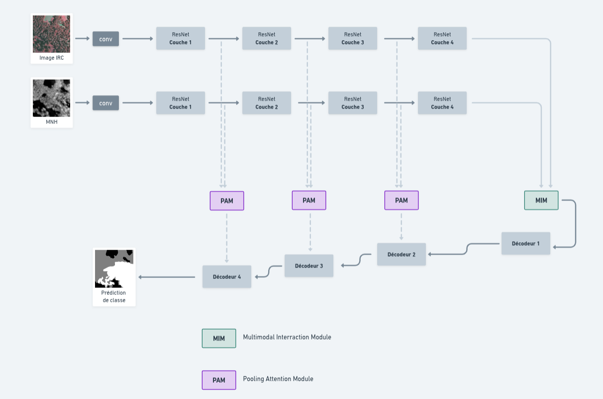
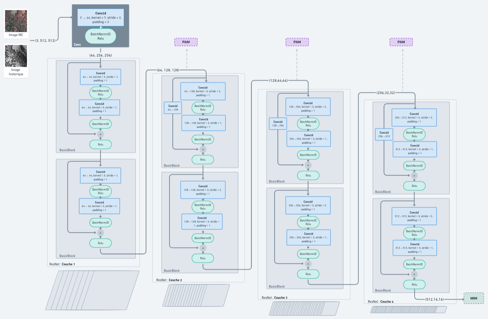
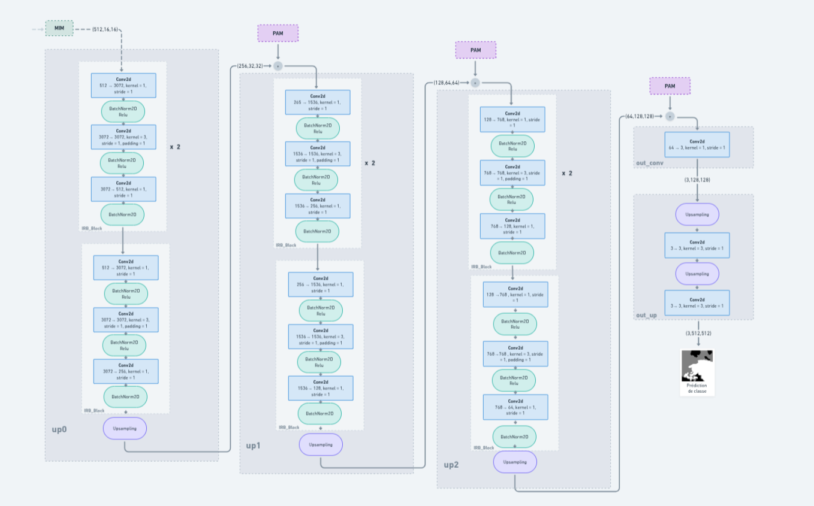
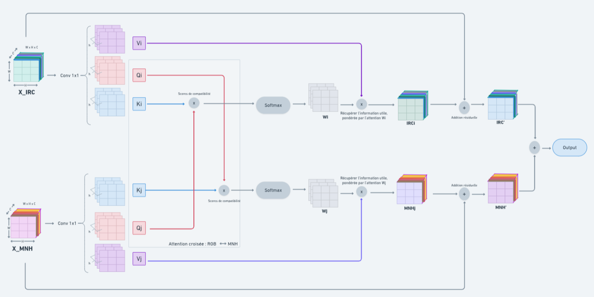
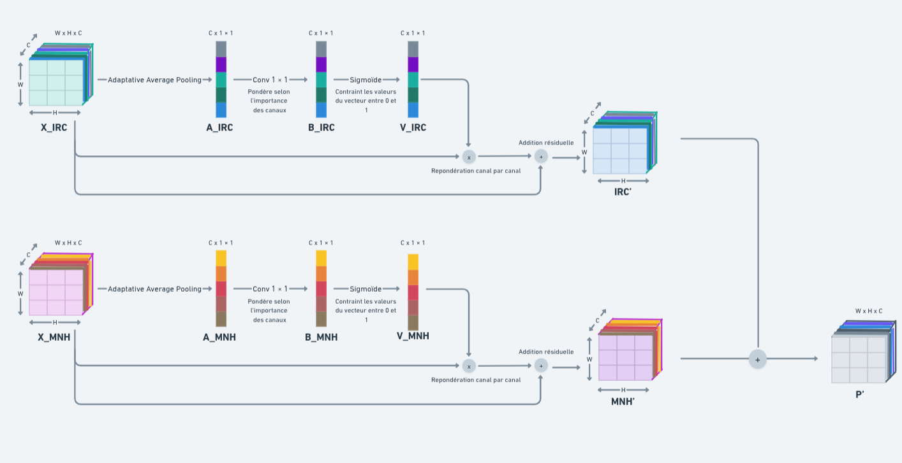

# Détection de la maturité écologique des forêts d’Occitanie

Ce dépôt contient un modèle de segmentation sémantique appliqué à l’estimation du degré de maturité écologique des forêts en région Occitanie.

Le modèle repose sur l’architecture [MIPANet](https://github.com/2295104718/MIPANet), une approche de segmentation RGB-D multimodale basée sur des mécanismes d’interaction croisée et d’attention. Elle permet d'exploiter efficacement la complémentarité entre les sources de données pour améliorer la précision de la segmentation.

Ce travail s’inscrit dans le cadre de ma thèse, dont l’objectif est de **cartographier à large échelle la maturité écologique des forêts par deep learning multimodale**.


  ## Structure du modèle
  ### Structure globale

   Voici un aperçu schématique de l’architecture globale du MIPANet:  

    

  ### Encodeur
   L’encodeur est un **ResNet18**. 

   

  ### Décodeur
   Le décodeur repose sur des blocs résiduels inversés (Inverted Residual Blocks, IRB), introduits dans **MobileNetV2**.  

   

  ### Pooling Attention Module  
   Le Pooling Attention Module (PAM) pondère les canaux des cartes de caractéristiques en fonction de leur importance, pour compenser la perte d'information lors de l'upsampling.  

    

  ### Multi-modal Interaction Module 
   Le Multi-modal Interaction Module (MIM) applique un mécanisme d’attention croisée entre les features IRC et MNH, permettant à chaque modalité d’enrichir ses représentations à partir de l’autre.  

  

  ## Structure du repo
```
MipaNet_modulable
   ├── model 
   │   ├── core 
   │   │     ├── early_stopping.py
   │   │     ├── loss.py
   │   │     ├── lr_range_test.py
   │   │     ├── metrics.py
   │   │     ├── optimizer.py
   │   │     ├── scheduler.py
   │   │     └── util.py
   │   │
   │   ├── datasets
   │   │     ├── base.py
   │   │     ├── files.py
   │   │     ├── format.py
   │   │     └── transforms.py
   │   │
   │   └── net
   │         ├── decoder.py
   │         ├── encoder.py
   │         ├── fuse.py
   │         └── util.py
   │
   ├── config.py
   │ 
   ├── train.py
   ├── lancer_entrainement.py
   │ 
   ├── test.py
   ├── lancer_test.py
   │ 
   └──resnet18-5c106cde.pth
```

  ## Structure du Dataset
```
Dataset
├── BIOM
│   └── dep_id.tif
├── HISTO
│   └── dep_id.tif
├── IRC
│   └── dep_id.tif
├── MASK
│   └── dep_id.tif
├── MNH
│   └── dep_id.tif
│
├── test.txt
├── val.txt
└── train.txt
```